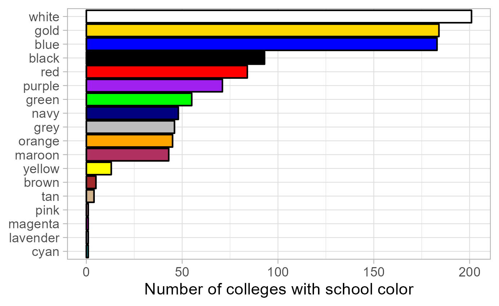

```{r setup, include=FALSE}
knitr::opts_chunk$set(echo = TRUE, message = FALSE, warning = FALSE, error = FALSE)
```

# Introduction

This tutorial covers how to scrape data from webpages and PDF documents using the `rvest` and `pdftools` packages in R.
The introduction to the HTML is a slightly modified version of the [Web Scraping with RVest](https://github.com/ccs-amsterdam/r-course-material/blob/master/tutorials/rvest.md) tutorial by Kasper Welbers, Wouter van Atteveldt & Philipp Masur.

# Motivation for scraping

The internet is a veritable data gold mine, and being able to mine this
data is a valuable skill.
In the most straightforward situation, you can just
**download** some data, for instance as a CSV or JSON file. This is
great if it’s possible, but alas, there often is no download button.
Another convenient situation is that some platforms have an **API**. For
example, Twitter has an API where one can collect tweets for a given
search term or user. But what if you encounter data that can’t be
downloaded, and for which no API is available? In this case, you might
still be able to collect it using **web scraping**.

A simple example is a table on a website. This table might practically
be a dataframe, with nice rows and columns, but it can be hassle to
copy this data. A more elaborate example could be that you want to
gather all user posts on a web forum, or all press releases from the
website of a certain organization. You could technically click your way
through the website and copy/paste each item manually, but you (or the
people you hire) will die a little inside. Whenever you encounter such a
tedious, repetitive data collection task, chances are good you can
automate it with a web scraper.

The idea of web scraping may seem intimidating, and indeed it can get quite complex.
However, the `rvest` R package simplifies the process considerably by using intuitive, tidyverse-based workflows for extracting data from HTML files.
With this package you don't need to have a complete understanding of how the underlying HTML scripts of a webpage are structured in order to extract data from the page.
Nevertheless, the next section introduces some basic concepts and structures when it comes to HTML files in order to give you a better understanding of what the `rvest` functions actually do.

# Scraping web pages

## HTML basics

The vast majority of the internet uses **HTML** to make nice looking
web pages. Simply put, HTML is a markup language that tells a browser
what things are shown where. For example, it could say that halfway on
the page there is a table, and then tell what data there is in the rows
and columns.
In other words, HTML translates data into a webpage that is easily readable by humans.
With web scraping, we’re basically translating the page back into
data.

To get a feel for HTML code, open [this link
here](https://bit.ly/3lz6ZRe) in your web browser. Use Chrome or Firefox
if you have it (not all browsers let you *inspect elements* as we’ll do
below). You should see a nicely formatted document. Sure, it’s not very
pretty, but it does have a big bold title, and two tables.

The purpose of this page is to show an easy example of what the HTML
code looks like. If you right-click on the page, you should see an
option like *view page source*. If you select it you’ll see the entire
HTML source code. This can seem a bit overwhelming, but don’t worry, you
will never actually be reading the entire thing. We only need to look
for the elements that we’re interested in, and there are some nice
tricks for this. For now, let’s say that we’re interested in the table
on the left of the page. Somewhere in the middle of the code you’ll find
the code for this table.

    <table class="someTable" id="exampleTable">           <!-- table                -->
        <tr class="headerRow">                            <!--    table row         -->
            <th>First column</th>                         <!--       table header   -->
            <th>Second column</th>                        <!--       table header   -->
            <th>Third column</th>                         <!--       table header   -->
        </tr>
        <tr>                                              <!--    table row         -->
            <td>1</td>                                    <!--       table data     -->
            <td>2</td>                                    <!--       table data     -->
            <td>3</td>                                    <!--       table data     -->
        </tr>
        <tr>                                              <!--    table row         -->
            <td>4</td>                                    <!--       table dat      -->
            <td>5</td>                                    <!--       table dat      -->
            <td>6</td>                                    <!--       table data     -->
        </tr>
    </table>

This is the HTML representation of the table, and it’s a good showcase
of what HTML is about. The parts after the `<!--` are comments and therefore do not affect the layout of the website. First of all,
notice that the table has a tree-like shape. At the highest
level we have the `<table>`. This table has three table rows
(`<tr>`), which we can think of as it’s children. Each of these rows
in turn also has three children that contain the data in these rows.

Let’s see how we can tell where the table starts and ends. The table
starts at the opening tag `<table>`, and ends at the closing tag
`</table>` (the `/` always indicates a closing tag). This means that
everything in between of these tags is part of the table. Likewise, we
see that each table row opens with `<tr>`, and closes with `</tr>`,
and everything between these tags is part of the row. In the first row,
these are 3 table headers `<th>`, which contain the column names. The
second and third row each have 3 table data `<td>`, that contain the
data points.

Each of these components can be thought of as an element.
It's these elements that we want to extract into R objects with `rvest`.

So let's use this simple example site to go over the main `rvest` functions.

## Simple example with `rvest`

First load the `rvest` and `tidyverse` packages, and specify the URL of the webpage we intend to scrape.
You can define the URL within as a separate object or inside the scraping function; since often you want to scrape multiple pages in one workflow, it is good practice to specify URLs outside the function.

```{r}
library(tidyverse)
library(rvest)

url <- "https://bit.ly/3lz6ZRe"
```

The function to read the HTML code from a URL into R is `read_html()`, with the URL as the function argument.

```{r}
html <- read_html(url)
```

The result of this function is a list containing the raw HTML code, which is quite difficult to work with.
So the next step is to extract the elements that we want to work with.

Elements can be selected with the `html_element()` or `html_elements()` function depending on whether you want to access only the first item matching the element specification or get a list of all fitting elements.

By element specification we usually refer to CSS selectors that categorize the object we want to extract.
CSS is mostly used by web developers to style web pages, but the CSS selectors are also a good way to identify types of data such as tables or lists.
Once we have the CSS selector we are looking for, we can add it as the argument of the `html_elements()` function, and extract only the parts of the HTML code that correspond to the selector.

There are quite a lot of [CSS
selectors](https://www.w3schools.com/cssref/css_selectors.asp), and the table below gives some of the main examples.
However, you don't actually need to remember any of these, but instead you can use selector tools to extract the information you need.

| selector      | example           | Selects                                                |
|---------------|-------------------|--------------------------------------------------------|
| element/tag   | `table`           | **all** `<table>` elements                             |
| class         | `.someTable`      | **all** elements with `class="someTable"`              |
| id            | `#steve`          | **unique** element with `id="steve"`                   |
| element.class | `tr.headerRow`    | **all** `<tr>` elements with the `headerRow` class     |
| class1.class2 | `.someTable.blue` | **all** elements with the `someTable` AND `blue` class |

Instead of going through the raw HTML and trying to match up the code to the observed website, you can use a browser extension that tells you the CSS selector you're looking for just by clicking on the part of the webpage that you'd like to select.
In Chrome this extension is called Selector Gadget.
You can simply search for the extension and install it, at which point you can use it on your chosen webpage by clicking on the extension in your list of installed browser extensions.

In the example webpage you can see that selecting the title gives you a CSS selector "h2" (which stands for level 2 header), while selecting any of the main text gives "p" for paragraph.
Selecting elements can sometimes get a bit difficult with the gadget, and you can't always get it to do exactly what you want: for example, it is hard to select the entire table and receive the selector "table", as the gadget often tries to select subitems of the table such as "td" instead.
If you can't get the gadget to select what you're looking for, it might be a good idea to go back to manually inspecting the HTML source code and looking for the element there.

If the selector gadget fails, the Inspect option of Chrome may be more helpful than viewing the full source code.
Inspecting the page allows you to focus on particular elements, because when you hover your mouse over the elements, you can directly see the correspondence between the code and the
page. The tree structure is also made more obvious by allowing you to
fold and unfold elements by clicking on the triangles on the left. Therefore you can quickly
identify the HTML elements that you want to select.

In this example let's try to extract the table with the ID "#exampleTable".
Alternatively, we can extract both tables by asking for all "table" elements.

```{r}
# Select the element with ID "exampleTable"
example_table <- html |>
  html_element("#exampleTable")
```

The output looks a bit messy, but what it tells us is that we have
selected the `<table>` html element/node. It also shows that this
element has the three table rows (tr) as children, and shows the values
within these rows.

In order to turn the HTML code of the table into a tibble, we can use the `html_table()` function.

```{r}
example_table_tidy <- example_table |>
  html_table()
```

Putting the whole workflow together, web scraping takes three main steps:

* load the full HTML code with `read_html()`
* extract the elements you need with `html_elements()`
* transform the HTML code to clean objects with e.g. `html_table()` or `html_text()`

To get both tables into a list of tibbles, we can use the following code chunk:

```{r}
tables <- read_html(url) |>
  html_elements("table") |>
  html_table()
```

Of course, in this case we worked with a very small and clean example, so the `tables` list already contains clean tibbles.
That is not always the case, and often you need further data wrangling steps to clean up variable names, data types, row structure, ect., but at that point you can use standard `tidyverse` workflows.

As another example, you can extract and display the text from the right column of the example page:

```{r}
read_html(url) |>
  html_elements("div.rightColumn") |>
  html_text2() |>
  cat()
```

We used the `html_text2()` function to transform HTML code into plain text (`html_text2()` usually creates nicer text output than `html_text()`), and then used the `cat()` function to print it on the screen.

Another nice function is `html_attr()` or `html_attrs()`, for getting
attributes of elements. With `html_attrs` we get all attributes. For
example, we can get the attributes of the `#exampleTable`.

```{r}
html |>
  html_elements("#exampleTable") |>
  html_attrs()
```

Being able to access attributes is especially useful for scraping links.
Links are typically represented by `<a>` tags, in which the link is
stored as the `href` attribute.

```{r}
html |>
  html_elements("a") |>
  html_attr("href")
```

# Web scraping case study: LAS colleges in the US

In the following we will work towards solving a hypothetical problem:

> You're starting a new liberal arts college, and there is one big unresolved question: what should the school colors be?
> You want to pick a nice set of colors, but you worry that some other colleges already use the same color scheme, and therefore your branding will be easily confused with existing colleges.
> Therefore you want to choose unpopular colors so your new college can stand out from the hundreds of existing liberal arts colleges.
> Unfortunately, there's no comprehesive database of the school colors of liberal arts colleges.
> However, this information usually shows up on the fact sheet of each college's Wikipedia page.
> In addition, Wikipedia also has a list of all LAS colleges in the US (see [here](https://en.wikipedia.org/wiki/List_of_liberal_arts_colleges_in_the_United_States)).

Given that there are hundreds of LAS colleges, it would be extremely time-consuming to one by one open their Wikipedia pages and extract their school colors into a spreadsheet.
However, Wikipedia pages are highly organized, so if we write a scraping script that works for the page of one college, it is likely to work for all colleges.
In addition, the list of all colleges contains hyperlinks to the individual college pages, which makes it easy to create a list of the URLs we would like to access.
Therefore, we can make a straightforward plan to tackle this initially quite intimidating problem.

1. Look at a few example Wikipedia pages to understand where they mention the school colors.
1. Write a scraping script that extracts the relevant information for a single college.
1. Get a list of URLs for all colleges.
1. Apply the scraping script repeatedly, changing only the URL.
1. Merge the extracted information.
1. Analyze/visualize the data.

## Scrape the fact sheet of a single college

Let's start by writing a scraping script for one college as a representative example.
In this case, let's use Amherst College, and try to extract the colors "white" and "purple" from the grey factsheet on the right hand side of the page.

The selector gadget shows us that we can extract the elements by referring to ".infobox".
Instead of extracting the infobox as a table, let's extract the variable labels and values separately into two character vectors, and combine them into a tibble afterwards.
We can do this by extracting ".infobox-label" and ".infobox-data" elements separately, and converting them into character strings with `htlm_text2()`.
In this case this is a better approach than extracting the whole table, because it gives us more control over the layout of the tibble, which makes it easier to handle slight differences in the different Wikipedia pages.
You can also try to extract the whole ".infobox" as a table, but you might need to take some additional steps of data wrangling e.g. to fix variable names.

```{r}
url <- "https://en.wikipedia.org/wiki/Amherst_College"
html <- read_html(url)

label <- html |>
  html_elements(".infobox-label") |>
  html_text2()

value <- html |>
  html_elements(".infobox-data") |>
  html_text2()

factsheet <- tibble(label, value)
factsheet
```

## Find and clean the school color values

The resulting `factsheet` tibble indeed contains the school colors, but also a lot of other information that we don't need.
In addition, the cell containing the colors also has some HTML code that wasn't removed by the previous code.
We might also want to make the color names more consistent so we can count the number of occurrences more easily (so e.g. we don't have "Red" and "red" separately).

One idea for making the color references more consistent is to allow only the colors that R recognizes.
While this is not the only approach and it will lead to a loss of information if a college uses a particular shade not defined in R, this approach has a nice advantage: when we visualize the distribution of colors, we can actually use the color codes defined in R to add color to our figure.
So let's extract the vector colors defined in R with the `colors()` function, and convert this vector to a single string with the colors separated by `|`.
Recall from the workshop on regular expressions that `|` in a regex stands for "OR", so using the resulting `r_colors` string as a pattern will detect any occurrence of an R color in a string.

```{r}
r_colors <- colors() |> paste(collapse = "|")
```

Now we can move on to wrangling our `factsheet` tibble: let's keep only the row containing the color, and use string operations to extract the colors appearing in the `value` variable.

By looking at the Wikipedia page, you might figure out that the weird ".mw-parser-output..." section of the value string refers to the displayed color squares.
If that part didn't contain any color references, there would be no problem with leaving it in the value, but notice that it specifies that the square border should be black.
So if we extract all colors appearing in the text, we'll mistakenly find that one of the school colors is black.
So let's remove the text creating these squares: it seems that it starts with ".mw-parser-output" and ends with ".mw-parser-output .legend-text{}" (normally you'd need to check the results from multiple different college pages to make sure that this pattern is consistent).

Once only the color (and some footnote references) remain in the cell, we can extract the colors recognized by R using `str_extract_all()`.
Note the use of `str_extract_all()` over `str_extract()` to make sure that we extract all colors if a school has more than one colors.

The result of `str_extract_all()` is a variable of character vector instead of single strings, which makes the variable quite hard to work with.
It would be better to have a row corresponding to every individual color a school has -- so we'd have two rows for Amherst, one with purple and one with white.
Then we can easily count how many universities use a particular color.
We can do this transformation by calling the `unnest()` function, which expands the character vector to become separate observations corresponding to each element of the vector.

```{r}
factsheet |>
  filter(label == "Colors") |>
  mutate(value = str_remove(value, "\\.mw-parser-output.*\\.mw-parser-output \\.legend-text\\{\\}"),
         known_color = str_extract_all(tolower(value), r_colors)) |>
  unnest()
```

## Get a list of colleges with Wikipedia links

Now that we have a scraper that should work for any LAS college Wikipedia page with the same structure as Amherst, we need a list of the URLs that we want to scrape.
Conveniently, there is a Wikipedia page of a list of LAS colleges, which features a list linking to all individual college Wikipedia pages.
So all we have to do is scrape that list and extract the URLs.

The selector gadget shows us that we can extract the list of schools with the element tag "#mw-content-text li a" -- that is, we're looking for elements of the content text that are both a list ("li") and a hyperlink ("a").
Then we can extract the attributes of the hyperlink to get the URL from "href" and the school name from "title", and combine the resulting vectors to a tibble.

Since there are a few links that have the same element tag as the school links, but are not school links, we can filter the resulting list of links by requiring that the link name includes "University" or "College" -- a quick look at the Wikipedia list shows that all schools meet this criteria.
In addition, looking at the URLs, you might notice that they are relative links that only contain the subpage of Wikipedia.
In order to open the URL with `rvest`, we need to complete URL, so we should add "https://en.wikipedia.org" to the start of each link -- the `paste0()` function does exactly that (it combines its arguments into a single string, with no separator between them).
The resulting `list` object is a tibble with two columns: the name of all colleges and their corresponding Wikipedia page URL.

```{r}
url <- "https://en.wikipedia.org/wiki/List_of_liberal_arts_colleges_in_the_United_States"

html <- read_html(url) |>
  html_elements("#mw-content-text li a")

list <- tibble(url = html_attr(html, "href"),
               name = html_attr(html, "title")) |>
  filter(str_detect(name, "(University|College)")) |>
  mutate(url = paste0("https://en.wikipedia.org", url))
```

## Write a function for extracting the color given a link

We will cover writing functions in more detail later in the apprenticeship, but for now let's have a look at the example below.
You might notice that the code inside the same code we have seen before: we extract the HTML code from a URL input, get the vector of infobox labels and data, and combine them into a tibble, keeping only the URL and the cell containing the color (notice that the `url` vector has a length of one and therefore gets recycled in the tibble).
By containing this code within a `function(){}` argument, we make the code reusable: we can rerun it just by calling the function name (in this case, `get_school_color`) and the arguments we would like to use as inputs.
In the function definition these arguments are listed inside the parentheses: in this case, the only argument is `url` so by calling the `get_school_color()` function with a different `url` argument will run the code in the function body (inside the curly braces), changing every mention of `url` into the the new URL specified in the function argument.

The example below shows how to use this new function to extract the school colors of Amherst.
Notice that if you run the function without assigning the result to a new object, it prints the final tibble created by the code in the function body.
This happens because in the function we don't assign this final tibble to an object, therefore by default it becomes the value returned by the function.
In turn, if we assign the outcome of the function to an object, then the resulting tibble of colors gets saved to the R environment (notice that our function behaves in the same way as pre-defined functions like `sum()` -- printing the result if the function is called, and saving it to the environment if assigned to an object).

```{r}
get_school_color <- function(url) {
  html <- read_html(url)

  label <- html |>
    html_elements(".infobox-label") |>
    html_text2()

  value <- html |>
    html_elements(".infobox-data") |>
    html_text2()

  tibble(url, label, value) |>
    filter(label == "Colors") |>
    select(-label)
}

get_school_color("https://en.wikipedia.org/wiki/Amherst_College")
amherst_color <- get_school_color("https://en.wikipedia.org/wiki/Amherst_College")
```

## Get all school colors and visualize the distribution

So the next thing to do is to run the function we just defined for all URLs that we have in our `list` object.
Again, we will cover appropriate functions for these repeated actions later, for now we'll just learn how to solve this particular challenge.

If you are familiar with other programming languages, you might consider using a loop to run the function for every element of the `url` variable of the `list` tibble.
In R, however, loops are not the best solution in many cases.
Instead, the `tidyverse` contains a package called `purrr` that contains functions that takes vectors and functions as its inputs: it runs the function one by one with each element of the vector as the function argument, and combines the results into a single object.
In this case, we can use the `map_df()` function to combine the results into a dataframe (the `map()` function uses a list instead), and we can take the vector of `list$url` as the potential arguments for the `get_school_color` function.
Since this single line of code opens and scrapes hundreds of webpages, it can take a few minutes to run.

```{r, eval = FALSE}
data <- map_df(list$url, get_school_color)
```

Once we have our `data` object that contains all the color information extracted from the webpages, we can take some additional steps of data cleaning in order to visualize the distribution of colors.
We can simply repeat the same steps that worked for the case of a single college.

First we create a string that defines all colors known to R, separated by `|` to use as a regex pattern.
Then we can take the `data` object, and remove the HTML code creating the color squares, and use the regex pattern to extract the colors recognized by R.
The extra line in the `mutate` function converts all occurrences of the color "navy blue" to "navy" because otherwise R will extract "navy" and "blue" separately and therefore inflate the occurrences of "blue" -- you'll notice issues like this after you try to extract the colors and have a look at the results.
We again use the `unnest()` function to have a new row for every element of the character vector of known colors.
In addition, we merge the results with the original `list` object so we can add the university names as identifiers in addition to the URL, and keep only the `name` and `known_color` variables, and only unique combinations of these values.
At this point you might also notice that `grey` and `gray` are both accepted spellings of the same color, so we can replace one with the other to make sure the spelling is consistent across colleges.

Once we have this `colors` tibble that contains the extracted colors for each college, it is quite easy to count the number of times each color appears and plot the results on a bar chart.
The `fct_reorder()` function in the aesthetic specification arranges the values based on the corresponding counts.
As for the bars, instead of specifying the `fill` as an aesthetic or a single value, we specify it as a character vector that has the same length as the number of categories plotted.
In this case we can exploit the fact that the `known_color` variable already contains color strings recognized by R, so by specifying the variable as the colors we want to use, each bar will be filled with the color corresponding to the category displayed.

```{r, eval = FALSE}
r_colors <- colors() |> paste(collapse = "|")

colors <- data |>
  mutate(value = str_remove(value, "\\.mw-parser-output.*\\.mw-parser-output \\.legend-text\\{\\}"),
         value = str_replace(value, "[nN]avy [bB]lue", "navy"),
         known_color = str_extract_all(tolower(value), r_colors)) |>
  unnest(known_color) |>
  left_join(list) |>
  distinct(name, known_color) |>
  mutate(known_color = ifelse(known_color == "gray", "grey", known_color))

color_counts <- colors |>
  count(known_color)

ggplot(color_counts, aes(n, fct_reorder(known_color, n))) +
  geom_col(fill = color_counts$known_color, color = "black") +
  xlab("Number of colleges with school color") + ylab(NULL) +
  theme_light()
```



The resulting plot shows how often each color is used as the school colors of a US liberal arts college.
The results are not perfect, as not all hues are recognized and therefore extracted by R: for instance, "cardinal" (a shade of red) is used by 14 colleges, but the color is not defined in R, so there is no bar for cardinal, and neither does it contribute to the counts of "red".
Nevertheless, there is certainly evidence that if you want your hypothetical school to stand out, white, blue and gold are certainly bad options for the school color.

# Pdf scraping with `pdftools`

Scraping pdf documents is useful for the same reason as scraping web pages: often you want to extract information from several documents with the same structure, and manually copy-pasting all that information would get very tedious.
In addition, if you ever tried to copy information from pdf files, you might have found that sometimes line breaks in the pdf copy over, tables get messy, headers and footers copy end up in the middle of the text, or special characters are lost.

Fortunately, there are a few R packages that make it easier to read pdf files into R as plain text.
Unfortunately, these tools are not perfect, and therefore pdf scraping usually involves a quick and easy first step of importing the data, and a far longer step of extensive cleaning of the messy character strings you imported.
Every pdf-scraping workflow is different based on how nicely the data imports, so it is hard to give a general workflow for this task.
Generally, you import the data, see what patterns you can find that help you identify the data you want to extract, and then use string operations to do so.
The example we'll cover here illustrates this workflow (with a relatively clean and structured example), but it doesn't cover all the possible issues that can come up in the process of working with pdfs.

We will use the `pdftools` package to actually read in the pdf files, so let's install and load it.

```{r}
# install.packages("pdftools")
library(pdftools)
```

As an example, we look at the Members of the European Parliament (MEPs) and their party affiliations.
The MEPs are listed [here](https://www.europarl.europa.eu/meps/en/full-list/all), with a link at the top right side of the page to download the list as a pdf.
Our goal is to convert this list into a clean tibble that contains separate variables for the name and affiliations of each MEP.

To import the pdf into R, you can either download the file and import it from your computer, or you can import it directly from the web.
In the latter case, you need to right-click on the "Download in PDF format" button and choose "Copy link address".
Then you can use the `pdf_text()` function to import the pdf file as a character vector, where each element corresponds to one page of the pdf.

```{r}
pdf <- pdf_text("https://www.europarl.europa.eu/meps/en/full-list/pdf")
```

Looking at the first page of the pdf, you can see that it is a very messy character string instead of a nice table.
Using the `cat()` function to display the text makes it more readable (e.g. by converting the new line characters to actual new lines), but it is still not a nice table.
But technically all the data is in R, so the importing step is done.

```{r}
pdf[1]
cat(pdf[1])
```

If we actually want to work with the data contained in the document, we need to clean it.
Currently the vector `pdf` is broken up based on page limits, while it would be more informative to have each element correspond to one MEP.
The most efficient way to change this split is to first merge all pages into a single string using the `paste()` function (using the same separator that we can observe between MEPs on the same page: a double new line `\n\n`), then split the resulting single string into a vector with one observation per MEP with the `str_split_1()` function (`str_split()` can handle multiple strings and returns a list; `str_split_1()` takes a single string and returns a vector).
We can use the `as_tibble()` function to convert the vector into a tibble, just to make it easier to display in the data viewer.

Looking at the resulting tibble, we can see two problems: not all rows correspond to MEPs, but some are empty strings or contain metadata such as dates, page numbers and data sources; and all information per MEP is in a single column.
To fix the first issue, we can see that other than the first row that starts with a "Members" title, all rows containing MEP information start with some whitespace (this corresponds to the unimported image locations in the original file).
Therefore if we remove the "Members" title from the string, all MEP rows will consistently start with whitespace, so we can remove any row that doesn't start with whitespace.
If we do so, that still leaves us with two remaining date specifications that weren't filtered out: at a closer look, we find that these rows start with a new line.
So if we remove new lines from the beginning of the string together with the "Members" title, our filter works fully as intended.

To fix the second issue, we can use the `separate()` function to split the single column into multiple columns.
Displaying an example cell in the console, it becomes clear that the separator between the name, the EU political group, and the country + national party is a new line character, so we can split based on that.
The resulting three new columns all have a lot of leading and trailing whitespace, so we can remove that with the `str_trim()` function; the `across(varlist, function)` specification allows us to apply the same transformation to multiple variables at once.

Lastly, the country and national party are currently in the same column because they are only separated by a regular space, not a new line like the other variables.
Instead of trying to do both of these steps with a single `separate()` function, it is much easier to first separate based on new lines, then run another `separate()` function to split the country and national party into separate columns - one column for the first word, and one for the rest of the text.
This time, we use an extra argument for the `separate()` function: `extra = "merge"`, which merges all remaining columns into the last one if there are more separators in the text than the number of new columns specified (by default they'd be dropped).

```{r}
pdf_data <- pdf |> 
  # merge all pages into one string
  paste(collapse = "\n\n") |>
  # split the string into a vector of MEPs
  str_split_1("\n\n") |> 
  # convert the vector into a tibble
  as_tibble() |> 
  # clean up string beginnings
  mutate(value = str_remove_all(value, "^(Members|\\n)*")) |> 
  # remove metadata rows (that don't start with whitespace)
  filter(str_detect(value, "^\\s+")) |> 
  # split based on new line separators
  separate(value, into = c("name", "eu_group", "country"), sep = "\\n") |>
  # remove leading and trailing whitespace from all variables
  mutate(across(everything(), str_trim)) |>
  # split the country variable into the first word and the remaining string
  separate(country, into = c("country", "party"), sep = " ", extra = "merge")
```

To show that the data is now in a clean format, we can visualize the number of MEPs from each EU political group and from each country.

```{r, fig.height=9,fig.width=6}
ggplot(pdf_data, aes(y = country, fill = eu_group)) +
  geom_bar() +
  xlab("Number of MEPs") + 
  ylab(NULL) +
  guides(fill = guide_legend(title = NULL, ncol = 1)) +
  theme_light() +
  theme(legend.position = "bottom")
```
